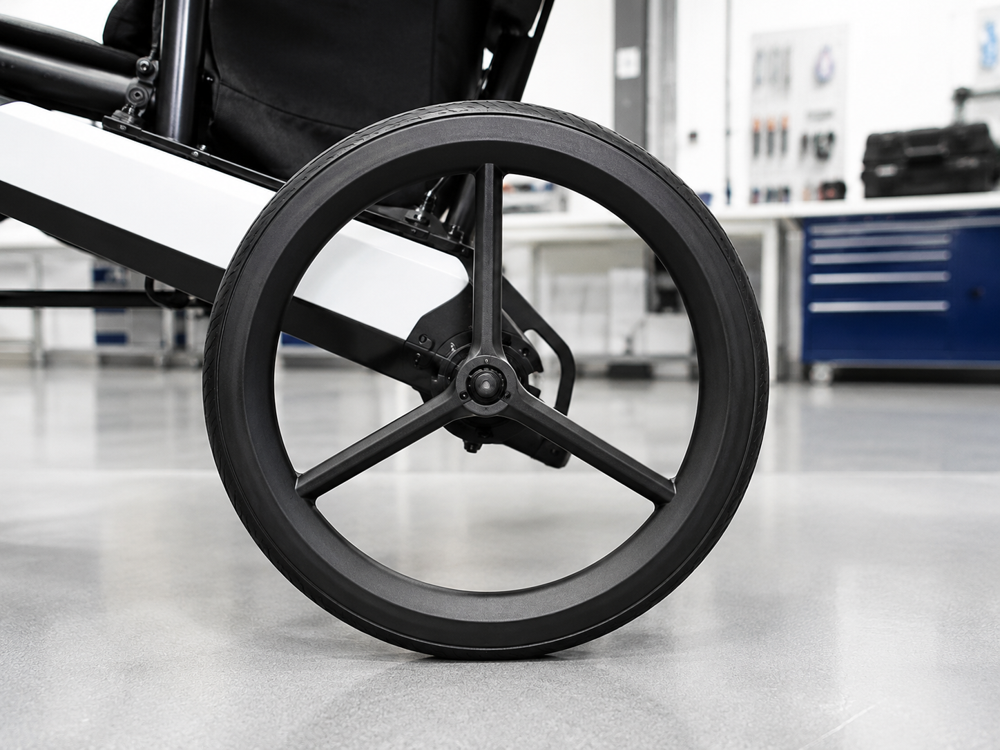

# Context-Rich Solid Mechanics Problem

## Load Sharing in a Three-Spoke Mobility Wheel Under Axle Load

### Engineering Context

A product engineering team is evaluating a lightweight three-spoke wheel used in a mobility device, small robotic platform, or compact ground-support vehicle. A vertical axle load is transferred from the hub into the spoke network and then into the rigid outer rim and ground contact region.

Because the rim is much stiffer than the spokes, the first-order mechanics model treats the rim as rigid. The spokes are modeled as axial members made from the same material and having the same cross-sectional area.

{fig-alt="Three-spoke mobility wheel in a workshop setting." width=100%}

### Main Engineering Goal

Determine the axial force in each of the three spokes under the applied axle load. Use the result to identify which spoke is in tension, which spokes are in compression, and what additional information would be required to perform a complete stress or factor-of-safety check.

### System Components

- rigid outer rim;
- central hub / axle point A;
- vertical spoke AB;
- left inclined spoke AC;
- right inclined spoke AD;
- ground contact region.

