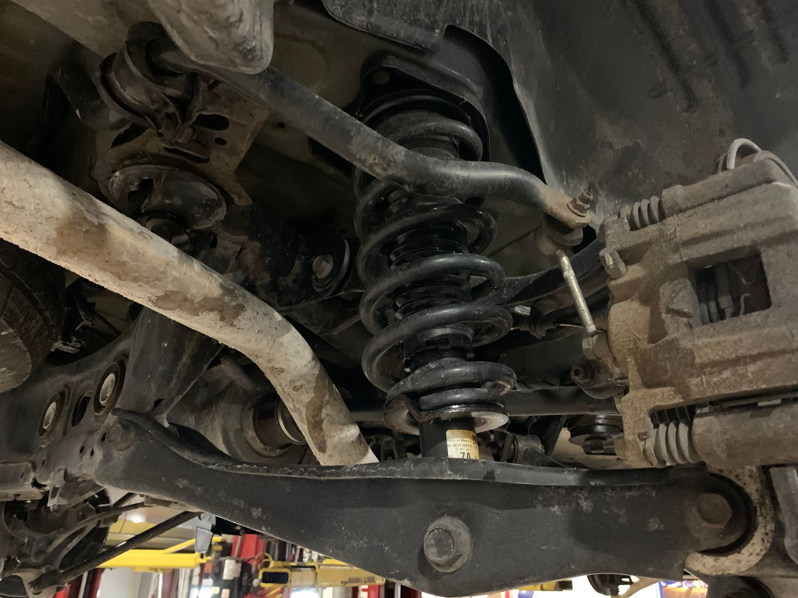

# Context-Rich Solid Mechanics Problem

## Automotive Suspension Compliance Using an Equivalent Spring-Loaded Axial Model

### Engineering Context

Automotive suspension systems support the vehicle body while allowing controlled relative motion between the wheel-side suspension and the chassis as the vehicle travels over road irregularities. The coil spring provides elastic support and compliance, while the shock absorber or damper controls oscillatory motion. Suspension links and mounting structures transfer the resulting forces between the wheel assembly and the vehicle body.

For this MEEN 305 problem, the complete suspension geometry is not analyzed directly. Instead, the real suspension is used to motivate a simplified equivalent axial model that isolates spring compression and elastic deformation of load-carrying members. This allows the deformation compatibility of a compliant mechanical assembly to be studied using standard Mechanics of Materials concepts.

{fig-alt="Automotive suspension spring-damper assembly viewed from beneath a vehicle." width=80%}

### Main Engineering Goal

Use a simplified equivalent mechanics model to determine how an applied load changes the separation between two reference locations, identify the dominant deformation contribution, and interpret what the result means for the compliance of the modeled suspension system.

### System Components

- coil spring;
- shock absorber / damper;
- lower suspension control arm;
- vehicle body / chassis mounting structure.
