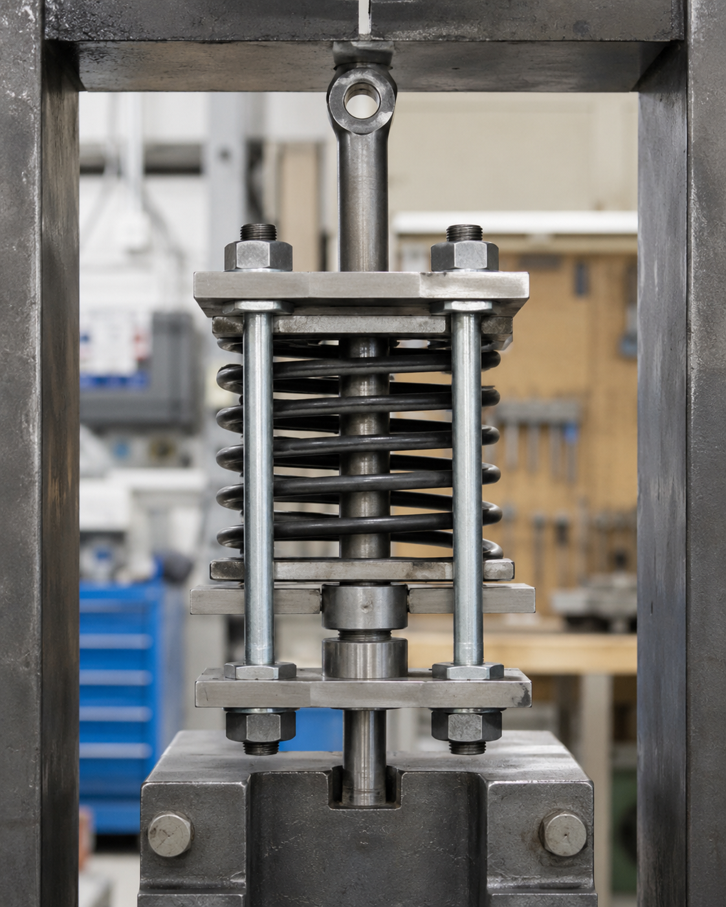

# Context-Rich Solid Mechanics Problem

## Spring-Loaded Coupling Rod Assembly Under Tensile Load

### Engineering Context

A mechanical design team is evaluating a spring-loaded coupling assembly used in an industrial machine fixture. The assembly uses a central coupling rod, rigid plates, side bolts, and a compression spring to transmit tensile load while allowing a controlled change in spacing. Similar arrangements appear in test fixtures, spring-return mechanisms, vibration-isolation hardware, and preload devices.

When the coupling rod is pulled, the spring compresses, the side bolts elongate, and the active coupling-rod segment elongates. The distance between lower plate C and upper eye E therefore changes through several deformation mechanisms.

{fig-alt="Industrial spring-loaded coupling rod assembly with rigid plates, side bolts, and compression spring." width=80%}

### Main Engineering Goal

Determine the final distance d between points C and E after loading by accounting for spring compression, side-bolt elongation, and active coupling-rod elongation.

### System Components

- central coupling rod and eye E;
- rigid plates A, B, and C;
- compression spring between A and B;
- identical side bolts connecting A and C;
- nuts and collars that transfer load.
