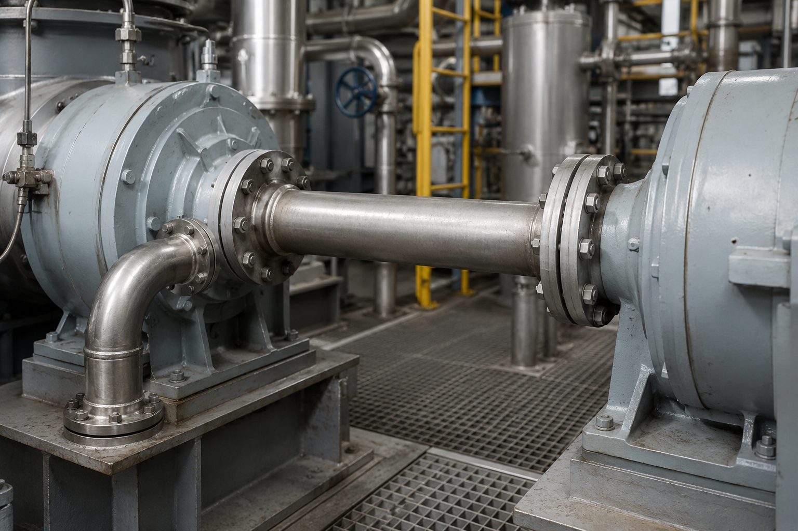

# Context-Rich Solid Mechanics Problem

## Thermal Expansion Force in a Steam Pipe Between Turbine Housings

### Engineering Context

High-temperature steam piping is commonly connected to turbines, compressors, pumps, and other process equipment in power-generation and industrial facilities. During startup, the pipe temperature can rise substantially above the installation temperature, causing the pipe to expand.

If the connected equipment and its supports were perfectly rigid, this thermal expansion would be strongly restrained and could generate large axial forces. In practice, the connected machinery and its mounting system have some flexibility, so part of the thermal expansion can be accommodated by movement of the equipment attachment locations.

Engineers must estimate the resulting thermal force because excessive piping loads can increase pipe stress and transmit large loads into equipment connections. The present analysis focuses on one-dimensional thermal expansion and axial restraint rather than a complete piping-code or flange-design assessment.

{fig-alt="Industrial steel steam pipe connected by flanges between two turbine housings." width=92%}

### Main Engineering Goal

Determine the axial force developed in the heated pipe due to restrained thermal expansion, determine the resulting pipe stress, and evaluate how flexibility of the connected equipment affects the thermal load.

### System Components

- steel steam pipe;
- turbine / rotating-machine housings;
- flanged pipe connections;
- machine support structure / foundation.
