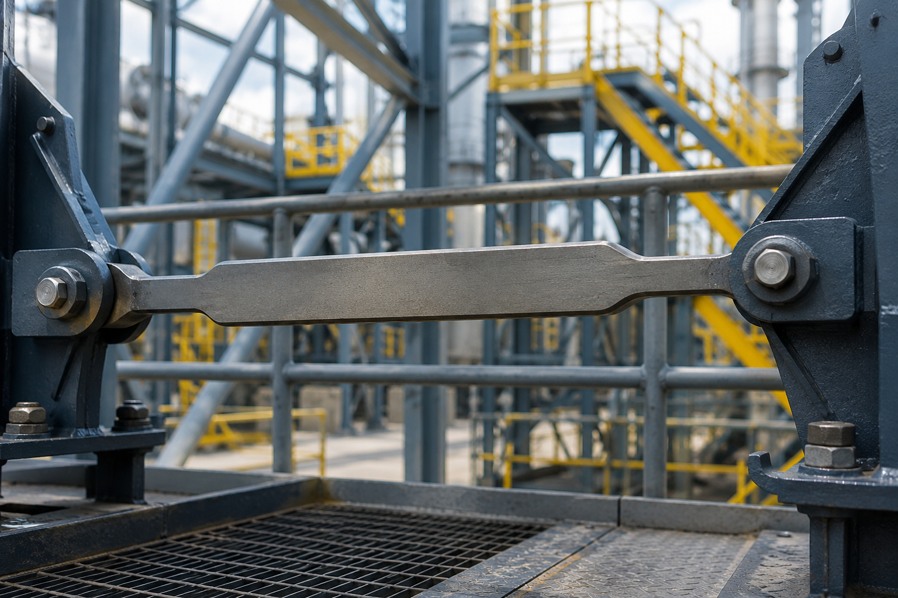

# Context-Rich Solid Mechanics Problem

## Maximum Axial Load and Elongation of a Stepped Steel Tension Link

### Engineering Context

A mechanical design team is evaluating a flat A-36 steel tension link used in an industrial support or machine-frame bracing assembly. The link transfers centered axial tensile force between two structural brackets.

To reduce weight while maintaining stiffness, the link has two end tabs and a wider reinforced center section. The maximum allowable load and the corresponding elongation must both be evaluated because excessive stress or deformation can affect the connected assembly.

{fig-alt="Flat stepped steel tension link pinned between two industrial structural brackets." width=92%}

### Main Engineering Goal

Determine the maximum allowable axial tensile load based on average normal stress, then calculate the total elastic elongation of the three-segment link at that load.

### System Components

- left end segment AB;
- center segment BC;
- right end segment CD;
- transition fillets near B and C;
- pinned or bolted end connections.
