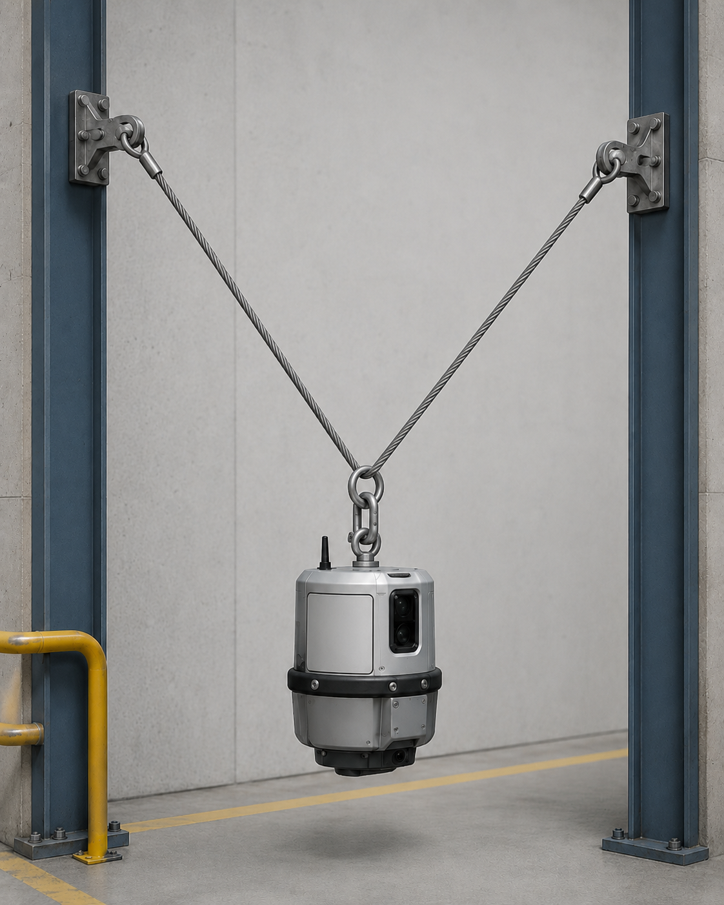

# Context-Rich Solid Mechanics Problem

## Suspended Industrial Equipment Pod Supported by Two Inclined Steel Cables

### Engineering Context

An industrial facility is installing a compact sensor or inspection equipment pod in a maintenance bay. The pod is suspended above the floor using two steel wire cables connected to wall-mounted brackets on opposite structural columns.

The cable angles are not symmetric, so the load is not shared equally between the two cables.

{fig-alt="Suspended industrial equipment pod supported by two inclined cables." width=100%}

### Main Engineering Goal

Determine whether the two inclined steel cables can safely support the suspended equipment pod under the specified static loading. Identify the cable with the larger tensile demand and determine either the minimum required cable diameter for a specified factor of safety or the actual factor of safety for selected cable diameters.

### System Components

- suspended equipment pod;
- left steel cable AB;
- right steel cable BC;
- lower ring / shackle at B;
- wall anchor bracket at A;
- wall anchor bracket at C.
