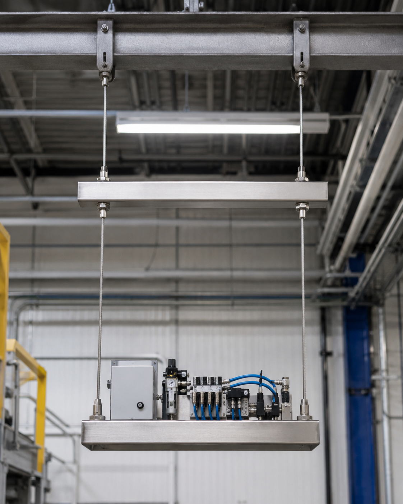

# Context-Rich Solid Mechanics Problem

## Suspended Industrial Equipment Platform Supported by Stainless-Steel Wires

### Engineering Context

A manufacturing facility is installing a suspended service platform that supports a compact equipment module above the production floor. The assembly has an upper rigid member and a lower rigid member connected by stainless-steel tension wires. The upper member is suspended from fixed overhead anchors by a second pair of wires.

Because the equipment load is placed off-center, the wires carry unequal forces. Their elastic elongations cause the rigid members to translate and rotate.

{fig-alt="Suspended industrial equipment platform supported by two levels of vertical wire hangers." width=72%}

### Main Engineering Goal

Determine the downward displacement of the equipment load and the small-angle tilt of each rigid member. Identify the wire carrying the largest force and the deformation contribution that most strongly influences platform motion.

### System Components

- fixed overhead support and anchors E and F;
- upper wires ED and FC;
- upper rigid member DC;
- lower wires AH and BC;
- lower rigid member AB;
- suspended equipment load P.
