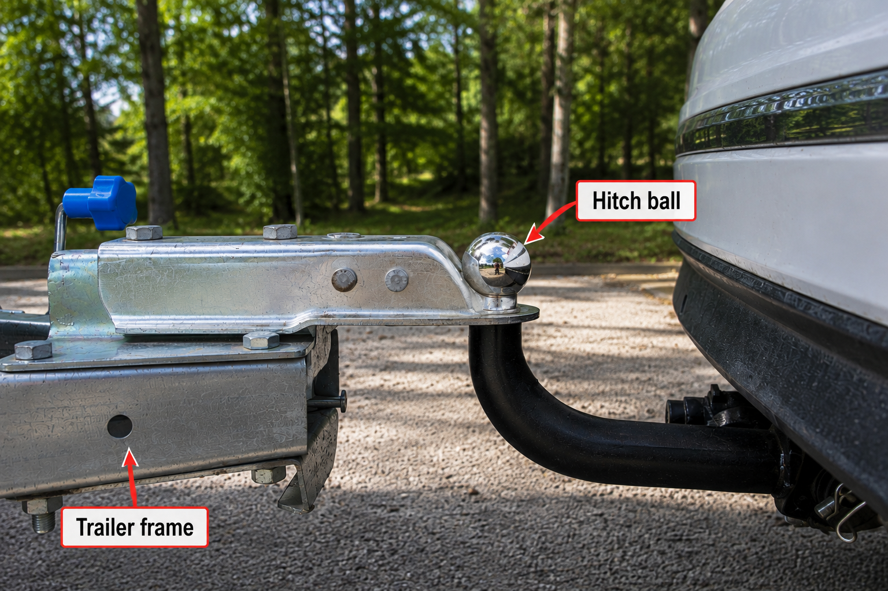

# Context-Rich Solid Mechanics Problem

## Trailer Hitch Ball Mount — Combined Loading and Strength

### Engineering Context

A trailer hitch ball mount transfers forces between a trailer and a towing vehicle. During towing, acceleration, and braking, the trailer coupler applies a horizontal towing/braking force and a vertical tongue load through the hitch ball. The ball mount carries these loads into the vehicle receiver.

The photographed component is curved and forged. For this problem, it is represented by a straight inclined-member load-path idealization and an equivalent circular receiver-side section. The idealization preserves the load application point and horizontal and vertical offsets required for equilibrium; it is not intended to reproduce the photographed geometry literally.

{fig-alt="Photograph of a trailer coupler connected to a hitch ball on a curved vehicle-side ball mount, with the hitch ball and trailer frame identified." width=88%}

### Main Engineering Goal

Determine whether the equivalent receiver-side section satisfies the required first-yield factor of safety under the assigned combined loading. If it does not, determine a minimum equivalent circular diameter and make a recommendation bounded by the simplified model.

### System Components

- trailer frame or tongue and coupler that deliver the trailer-side loads;
- hitch ball at the load-transfer interface;
- curved or forged ball mount represented by an equivalent load-path member;
- vehicle receiver represented by a fixed restraint; and
- receiver-side equivalent circular section evaluated for strength.

### Scope of the Model

Treat the loads as concentrated and static, neglect ball-mount self-weight, and assume homogeneous isotropic ductile steel with linear-elastic behavior through first yield and small deformation. The equivalent section at C is normal to the horizontal receiver axis, so the prescribed horizontal force is its normal-force resultant and the vertical load is its transverse-shear resultant. Exclude local stress concentrations, detailed receiver and pin behavior, hitch-ball/coupler contact stress, fatigue, dynamic impact, exact forged geometry, material/process variability, and regulatory certification.
