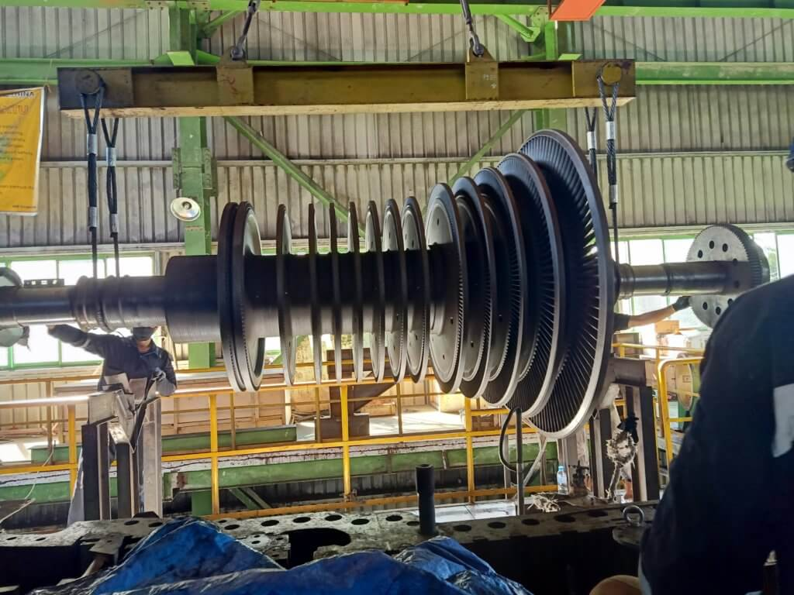

# Context-Rich Solid Mechanics Problem

## Torsional Response of a Multi-Stage Turbine Rotor

### Engineering Context

Multi-stage steam turbines and gas turbines convert fluid energy into rotating shaft power through several rows of blades mounted along a common rotor. In power-generation equipment, steam or hot gas acts on successive turbine stages and produces torque at each stage. That torque is transferred through the blade roots and rotor disks into the central shaft and ultimately to connected drivetrain equipment such as a generator.

Unlike a shaft loaded by a single concentrated torque, a turbine rotor can receive torque continuously over a substantial axial region containing many blade stages. The cumulative torque carried by the shaft therefore changes along the rotor. Understanding that variation is important because both torsional shear stress and angular twist depend on the internal torque distribution, not only on the total power produced by the machine.

For this assessment, the detailed blade-by-blade loading is replaced by an equivalent distributed torque acting over the active turbine-stage region. The objective is to connect the physical turbine system to a one-dimensional torsion model and determine how a spatially varying applied torque produces a nonuniform internal-torque field, shaft stress, and twist.

{fig-alt="Industrial multi-stage turbine rotor suspended during assembly or maintenance." width=88%}

### Main Engineering Goal

Determine the torsional reaction required to balance the distributed turbine-stage loading, construct the internal torque distribution, calculate the maximum torsional shear stress and relative angle of twist, identify the governing shaft section, and explain which geometric or material changes would most effectively reduce the torsional response.

### System Components

- turbine rotor shaft;
- turbine blade stages and rotor disks;
- journal bearings;
- turbine support structure;
- drivetrain connection.
