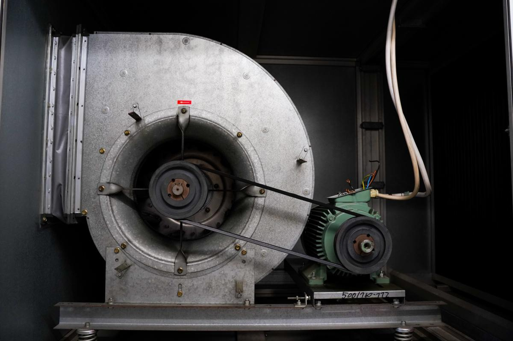

# Context-Rich Solid Mechanics Problem

## V-Belt Tension in a Factory Ventilation Blower Drive

### Engineering Context

A factory ventilation system uses an electric motor to drive a centrifugal blower through a V-belt and pulley arrangement. The belt must carry unequal tensile forces on its tight and slack sides so that their difference produces the torque required at the driving pulley. Excessive belt tension can overstress the belt, while insufficient tension can prevent reliable power transmission.

{fig-alt="Industrial centrifugal blower and electric motor connected by a visible V-belt and pulley system." width=86%}

The photograph establishes only the physical application and load path. All numerical dimensions, operating conditions, equivalent belt area, and allowable stress are instructor-assigned representative teaching values and are not specifications of the photographed equipment.

### Main Engineering Goal

Determine the tight-side and slack-side V-belt tensions required to transmit the specified motor power. Then, as an instructor-defined Solid Mechanics extension, model the belt as an equivalent tensile member and compare its tight-side average normal stress with the assigned allowable stress.

### System Components

- electric motor that provides rotational power;
- small motor pulley attached to the motor shaft;
- V-belt that transmits power as unequal tight-side and slack-side tensile forces;
- driven pulley that receives power from the belt;
- blower shaft and bearings that support the driven pulley and rotor; and
- centrifugal blower that uses the transmitted power to move ventilation air.

### Scope of the Model

Assume steady operation, no belt slip, negligible belt mass and centrifugal effects, and uniform axial tension in each straight belt span. Use the supplied operating ratio (k=T_2/T_1); no capstan or belt-friction derivation is required. Neglect pulley and shaft stresses, local belt bending, fatigue, wear, thermal effects, startup transients, and detailed V-groove contact mechanics.

The equivalent-area stress calculation is an instructor-defined educational extension for practicing average normal stress. It is not a standard commercial V-belt sizing or selection method.
