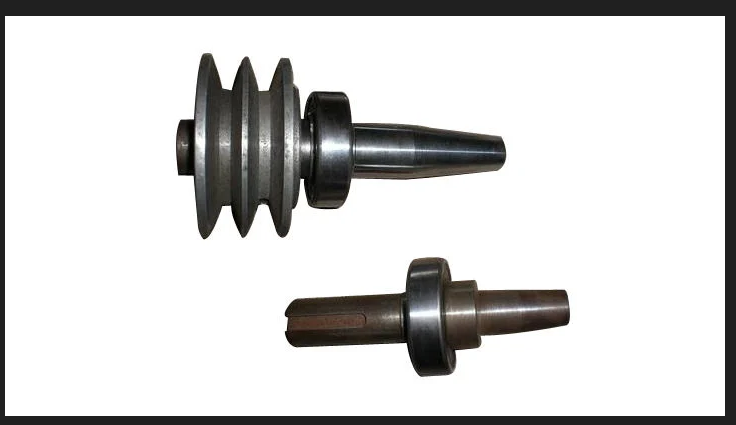

# Context-Rich Solid Mechanics Problem

## Torsional Stiffness of a Variable-Section Industrial Spindle

### Engineering Context

Variable-section shafts are used in machine tools and industrial rotating equipment because different parts of the shaft have different mechanical requirements. Larger-diameter regions may be needed for bearings, pulleys, couplings, or tooling interfaces, while other regions can be smaller to reduce material and rotating mass.

This creates an important mechanical tradeoff. Increasing shaft radius greatly increases torsional stiffness because the polar moment of inertia varies strongly with radius, while reducing the radius lowers mass and rotational inertia. However, the smaller-radius regions twist more and experience higher torsional shear stress, so they can control the overall shaft response.

{fig-alt="Industrial variable-section spindle with pulley features and tapered shaft regions." width=88%}

In this problem, the detailed industrial spindle is simplified as a smooth variable-radius shaft. The goal is to determine the total angular twist, identify which region contributes most to the torsional deformation, and determine whether the shaft satisfies the required rotational-stiffness limit.

### Main Engineering Goal

Determine the angular rotation of the torque-input end relative to the restrained machine interface, identify the region that contributes most strongly to torsional compliance, evaluate the maximum torsional shear stress, and determine whether the shaft satisfies the specified 1.0 degree rotational serviceability limit.

### System Components

- rotating spindle or shaft;
- drive pulley or torque-input component;
- bearing and support interfaces;
- connected machine or tooling interface.
