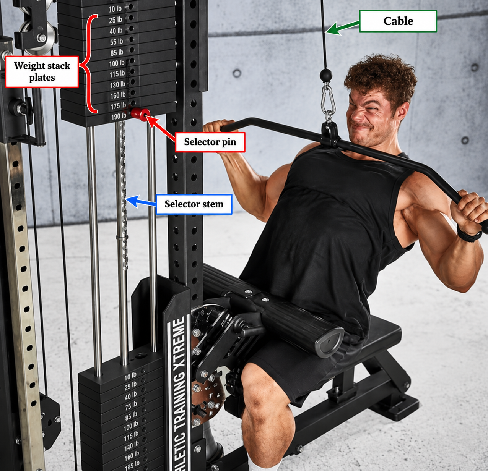

# Context-Rich Solid Mechanics Problem

## Double-Shear Safety of a Weight-Stack Selector Pin During a Lat Pulldown

### Engineering Context

Selectorized cable machines use a horizontal pin to connect the cable-driven selector stem to a chosen portion of a weight stack. During a controlled lat pulldown, the cable lifts the stem, and the pin transfers that load into the selected plate so the selected plate and all plates above it rise together.

You are part of a fitness-equipment engineering team checking whether the specified circular stainless-steel selector pin safely carries the selected moving-stack load in an introductory double-shear model.

{fig-alt="Annotated lat-pulldown machine identifying the cable, selector stem, horizontal selector pin, and weight-stack plates." width=88%}

### Main Engineering Goal

Determine the selector pin's average double-shear stress and factor of safety against shear yielding. Then determine the minimum required pin diameter and make an engineering recommendation bounded by the simplified model.

### System Components

- cable that transmits the user's pull;
- selector stem that lifts through the center of the stack;
- horizontal selector pin analyzed as the connector; and
- selected weight plate and plates above it that form the moving stack.

### Scope of the Model

Treat the selected plates as one translating mass lifted at controlled constant speed. Model the circular pin in symmetric direct double shear with equal load sharing between two shear planes and uniform average shear stress. Neglect pin bending, bearing and tear-out, fatigue, wear, clearance and impact effects, friction, cable/pulley losses, stress concentrations, and local deformation.
