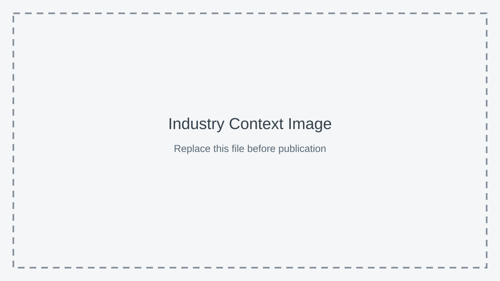

# Context-Rich Solid Mechanics Problem

## __PROBLEM_TITLE__

### Engineering Context

Replace this paragraph with one or two concise paragraphs that establish the real engineering system, the student's role, the operating situation, and the mechanical performance concern.

{fig-alt="Placeholder for the industry-context image. Replace this asset and alt text before publication." width=88%}

### Main Engineering Goal

Replace this paragraph with one clear mechanics-based decision goal. State what students must calculate, evaluate, or recommend.

### System Components

- replace with the primary loaded component;
- replace with the load-transfer or connection component;
- replace with the relevant supports or constraints; and
- remove any component that does not support the intended mechanics analysis.
